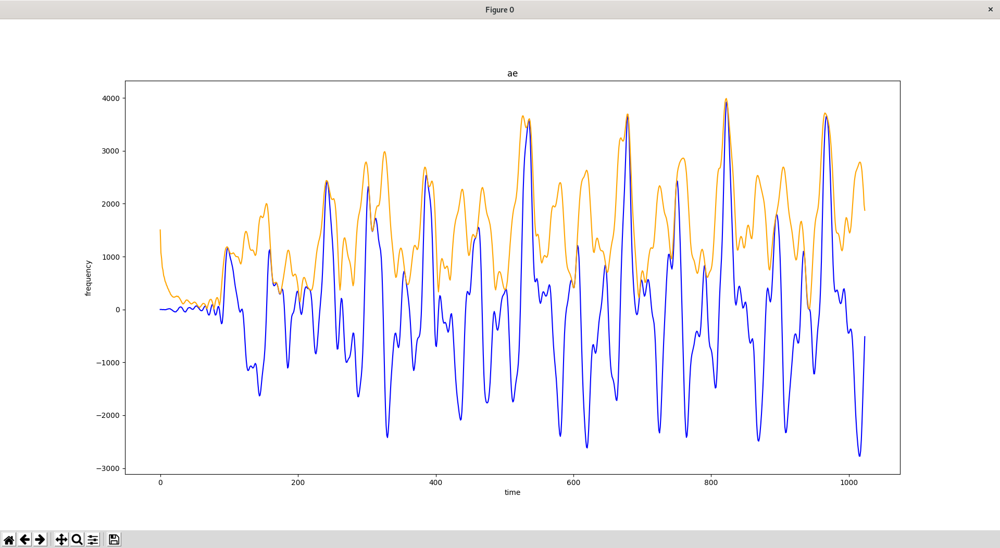

# Amplitude Envelope module for Bard's Way #
>
> Calculate the amplitude envelope of the given audio segment.
>

## Summary: ##
- Usage
- Functions
- Library Used
- Graphical Result

## Usage: ##
Function `amplitude_envelope` method to calculate the amplitude envelope of the given audio.

```python
amplitude_envelope(signal = numpy.ndarray)
```
##  Functions: ##

```python
amplitude_envelope(signal = numpy.ndarray)
```
>
> Return the amplitude envelope of the give audio segment given as numpy ndarray.
>

#### Parameters: ####
&nbsp;&nbsp;&nbsp;&nbsp;&nbsp;&nbsp;&nbsp;&nbsp;**signal** The data that we want to analyse.

### Return: ####
&nbsp;&nbsp;&nbsp;&nbsp;&nbsp;&nbsp;&nbsp;&nbsp;Array[0.0, ...].

##  Numpy: ##

`Numpy.ndarray` : An array object represents a multidimensional, homogeneous array of fixed-size items. An associated data-type object describes the format of each element in the array.

`Numpy.fft` returns : Numpy.ndarray of the truncated or zero-padded input, transformed along the axis indicated by axis, or the last one if axis is not specified.

##  Library Used: ##

-We use `numpy` and more particulary the `fft` part of Numpy because it's the easiest and efficient way to calculate the the fast fourier transform. And there is many way to reuse this library for many other purpose link with our project.
> `Numpy` got the BSD 3-clauses license. The BSD 3-clauses license is permitting us to commercialise our project wi> th the library it protect, so it's perfect for an EIP project.
-We use `scipy` and more particulary the `signal` part because it's the best mathematical answer to calculate the the short time fourier transform with multiple variation.
>`scipy` got the BSD-new license. The BSD-new license is permitting us to commercialise our project with the librar>y it protect, so it's perfect for an EIP project.

##  Graphical Result: ##

This graph was generated with this line of code :
```python
do_overlap_plot(range(len(ae)), signal, range(len(ae)), ae, labels=["time", "frequency", "ae"])
```



The blue curve represent the signal of audio file.
The orange curve represent the amplitude envelope of the blue signal.
