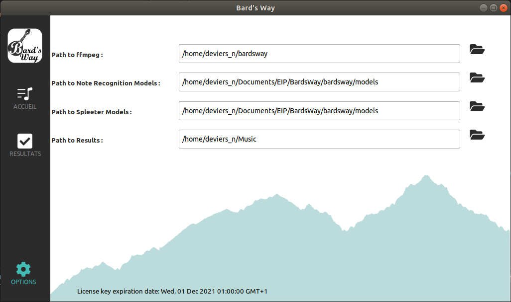

# Bard's Way graphical software #
>
> Usage documentation for Bard's Way
>

## Summary ##
- Overview and Usage
    - Home panel
    - Results panel
    - Options panel
- Libraries Used

## Overview ##

The software is composed of 3 panels. You can navigate between the those through the sidebar on the left of the window.

### Home panel ###

At launching the software, the user lands on the Home page where resides the core of the product.

The top bar is an entry showing the name of the musical file to be processed by Bard's Way. It MUST be a .wav file, otherwise it won't work as we are not yet handling other types of encryption.
The file is to be selected through the blue button on the right of the bar.

When the file is selected and appears on the bar, the rocket icon turns blue. That means that the software is ready to process the song. Clic on the rocket to do so.

The three dark rectangles are log entries - similar to those seen on the installer - detailing the progress of the execution of the several technical. On the top left log, Spleeter's logs will appear whereas the note recognition's logs will be prionted on the top right log. Finally, the bottom log entry will detail every potential error that may occur during the process.

### Results panel ###

This panel will display the content of the folder pointed at by the options "Results", in the Options panel.
The musical files processed through Bard's Way will end up here allowing the user to see and listen the sountracks extracted from the them.

As one clic for the first time on a folder, it will take a bit of time to load in order to generate the oscillograms of each subtrack. This inconvenience however only occurs once per folder.

Then, each subtrack can be listened to individually and recuperated at the end of the "Results" path.

On the rigth of the screen will appear a scrollable partition of each soundtrack, generated from the midi file.

### Options panel ###

On this panel, the user can chose where to store files, or where are stored necesary ressources:
- ffmpeg: it's a library used to handle musical files.
- Spleeter's instrument separation models: it's the path to the models used by Spleeter to perform the separation..
- BardsWay's note recognition models: it's the path to the models used by Bard's Way to perform the note recognition.
- Results: it's the path to the folder where all data generated by the software (note recpgnition and instrument separation) will be stored.

Those paths can be modified through the folder icon on the far right of each path.

On the very bottom is written the license's peremption date. From this moment, you won't be able to operate the software anymore without renewing your license.

## Libraries Used ##

The graphical aspect of this installer was realized with PySciter, a Python implementation of the graphical library Sciter.

For optimization purposes, the library Threading was used to download simultaneously several sources because it is the only python multi processing library functional on both Linux and Windows.

As it requires to install sources stored on our servers, the python library Requests is also used.

To protect your data in case the software would need you to log in again, your credentials are encrypted with the Hashlib library.

To handle the transit of Bard's Way's logs from the scripts to the software, we use the Logging library.