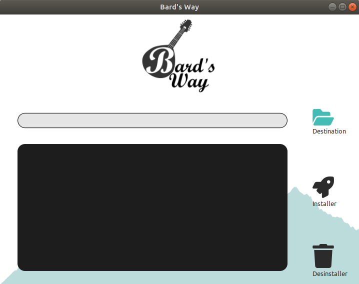

# Bard's Way graphical Installer #
>
> Usage documentation for Bard's Way Installer
>

## Summary: ##
- Usage
- Libraries Used

## Usage ##

### Install or Uninstall ###

When you launch the installer a window appears, offering the following options:
- Choose the path where to install or uninstall Bard's Way.
- Execute the installation.
- Uninstall the software.

The center-left bar will print the chosen location, which is necessary in order to start downloading Bard's Way's sources. It'll later turn into a progression bar representing the level of avancement of the chosen option.

The dark rectangle on the bottom-left is a log entry, displaying the progression of the software and printing errors that may occur while installing or uninstalling the software.

In order to either install or uninstall Bard's Way, you must first select where the software is going to be installed / is currently located, then clic on the wanted option.

If you are installing, your credentials will be asked at this moment through a pop-up window in order to verify your license. Enter your email-address and password given at the purchase of the software to unlock the download of the sources.

The process is then fully automated, and its progression can be followed through the log entry and the progression bar.

### Update ###

If Bard's Way is already installed on your computer and you wish to update it, with the same installer select it's location on your computer before clicking Install.
The software will compare the sources on your computer with the latest versions of the software on our servers, and update the deprecated files.

## Libraries Used ##

The graphical aspect of this installer was realized with PySciter, a Python implementation of the graphical library Sciter.

For optimization purposes, the library Threading was used to download simultaneously several sources because it is the only python multi processing library functional on both Linux and Windows.

As it requires to install sources stored on our servers, the python library Requests is also used.

To protect your data, your credentials are encrypted with the Hashlib library.