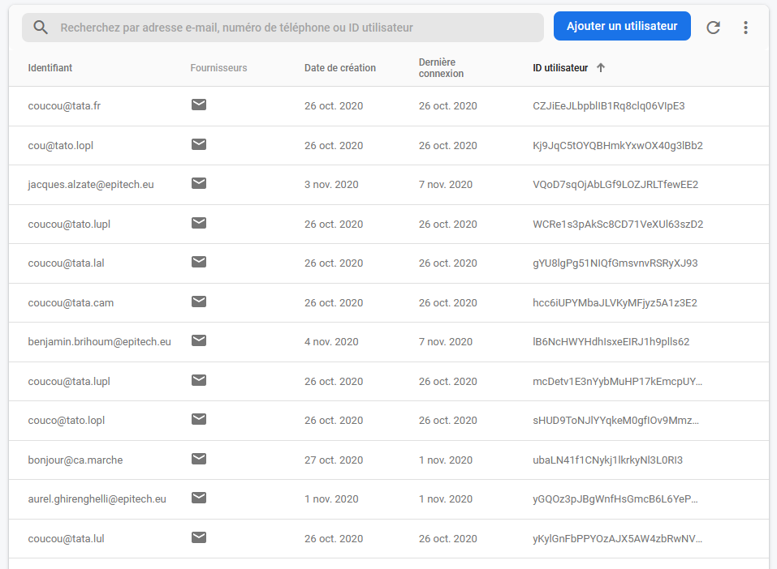

# Bard's Way Database #
>
> Bard's Way Database documentation
>

We declared Bard's Way as a google project to have access to all the google API from the google cloud platform. Within these tools we principally use google Firebase.

## Summary: ##
- Firebase
  - Authentication
  - Firestore
- API routing
- Data Encryption


## Firebase: ##

For our database we decided to use Firebase.
Firebase is a solution made by google designed to easily make secure database, it's a very powerful tool and we don't use all the option it offer to us.
Here we gonna detail the Firebase tool we use and how we use it.

The application work on 8080 port and the 404 and 403 error is handle.

#### Authentication: ####

With the authentication window we can see all the user that registered in bard's way.



Here we can see each user with, in order, their email, how they registered, the creation date, the last connection and their ID.

#### Firestore: ####

With the Firestore window we can see the user registered in database and all the field we defined for the user database.


For now we have one collection for the user database, in this collection each document is named after the id we saw earlier, so it's easy to search for one particular user.

For each document we got several field :  
`email(string)` : the user email.  
`isAdmin(bool)` : is the user an admin.  
`isLicenceKeyActivated(bool)` : if the user have a license.  
`licenceActivationDate(timestamp)` : the date the user activated his key.  
`licenceExpirationDate(timestamp)` : the date the license will expire.  
`licenceKey(string)` : the license key.  
`nightModeEnabled(bool)` : if the user has the night mode enabled or not.  
`refreshToken(sting)` : the user refresh token.  
`token(string)` : the user token.  
`tokenExpirationDate(timestamp)` : the expiration date of the user token.


Here we can see a user with an activated license.

## API routing: ##

`/login(post)` :  
The login route is used when a user try to login in bard's Way.  
**Argument** : one body with the email and the password like this :  

```json
{
  "email":"john.doe@epitech.eu",
  "password":"1234"
}
```  
**Return** :  Display "Logged successfully!" in the console log if the call is a success.  
**Error** : Three errors are meant to possibly happen, one if there is an error during the login, one if there is an error during the modifying of the document and on if there is an error with the refreshing token.

`/signup(post)` :  
The signup route is used when a user try to signup in bard's Way and it created a Stripe customer id.  
**Argument** : one body with the email and the password like this :  

```json
{
  "email":"john.doe@epitech.eu",
  "password":"1234"
}
```  
**Return** :  Display "EMAIL SENT" and "Done." in the console log if the call is a success.  
**Error** : Two errors are meant to possibly happen, one if there is a problem while sending the verification email, one if there is an error within the creation of the user.


`/resetPassword(get)` :  
The resetPassword route is used by the user to reset his password.  
**Return** :  Display "PASSWORD RESET DONE" in the console log if the call is a success.  
**Error** : One errors can happen if there is a problem during the password reset.

`/isAdmin(get)` :  
The isAdmin route is used by the user to know if he his an admin.  
**Return** :  Display User ID + "is an admin!" in the console log if true and display User ID + "is not an admin!" in the console log if false.  
**Error** : One errors can happen if there is a problem during admin status check.

`/createKey(get)` :  
The createKey route is used by the user to create a license key.  
**Return** :  Display User ID + "have a new licenceKey:" + license key created in the console log if the call is a success.  
**Error** : One errors can happen if there is a problem during setting of the key.

`/deleteKey(get)` :  
The deleteKey route is used by the user to delete his license key.  
**Return** :  Display user ID + "have revoke is licenceKey." in the console log if the call is a success.  
**Error** : One errors can happen if there is a problem during the key deleting.

`/activateKey(get)` :  
The activateKey route is used by the user to activate his key.  
**Return** :  Display "License activated." in the console log if the call is a success.  
**Error** : One errors can happen if there is a problem during the license key activation.

`/deactivateKey(get)` :  
The deactivateKey route is used by the user to deactivate his key.  
**Return** :  Display "Document successfully deleted!" in the console log and "'User has been successfully deleted!" to the user if the call is a success.  
**Error** : Two errors can happen, one if there is a problem during the removing of the document and one if there is a problem during the user deletion.

`/deleteUser(delete)` :  
The deleteUser route is used by the user to delete his account.  
**Return** :  Display "PASSWORD RESET DONE" in the console log if the call is a success.  
**Error** : One errors can happen if there is a problem during the password reset.

`/license(get)` :  
The license route is used to get the license of one user.  
**Return** :  Display the license key or NULL if it don't exist.  
**Error** : One errors can happen if there is a problem during the operation.


##### Stripe routing: #####

For the Stripe route, check the [Stripe Payment documentation](./documentation_stripePayment.md)

## Data Encryption: ##

All of the data encryption is performed by Firebase automatically.  
Firebase use a SHA-256 on each data store in the databse.  
It also perform an hash encryption with a base64 key, described like so :


