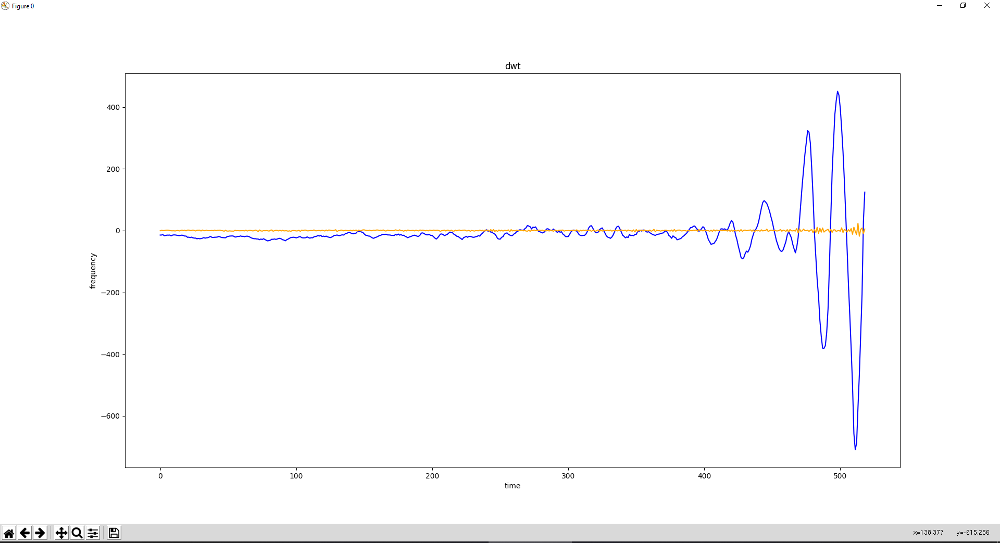

# Discret Wavelet Transform module for Bard's Way #
>
> Calculate the discret wavelet of the given audio segment with the Gaussian wavelets algorithm.
>

## Summary: ##
- Usage
- Functions
- Numpy & Pywt
- Library Used
- Graphical Result

## Usage: ##
Function `discret_wavelet_transform` method to calculate the simple discret wavelet of the given audio.

```python
discret_wavelet_transform(frequency = numpy.ndarray)
```
##  Functions: ##

```python
discret_wavelet_transform(frequency = numpy.ndarray)
```
>
> Return an approximation and detail coefficients of the audio segment discret wavelet.
>

#### Parameters: ####
&nbsp;&nbsp;&nbsp;&nbsp;&nbsp;&nbsp;&nbsp;&nbsp;**frequency** The data that we want to analyse.

### Return: ###
&nbsp;&nbsp;&nbsp;&nbsp;&nbsp;&nbsp;&nbsp;&nbsp;Tuple of 2 array of floats value like (a[0.0, ...], b[0.0, ...]).

##  Numpy & Pypwt: ##

`Numpy.ndarray` : An array object represents a multidimensional, homogeneous array of fixed-size items. An associated data-type object describes the format of each element in the array.

`Pypwt.discret_wavelet_transform` returns : A tuple (a, b) of two array of float of the approximation and detail coefficients.

##  Library Used: ##

We use `pywt` and more particulary the `discret_wavelet_transform` part because it's the best mathematical answer  to calculate the the discret wavelet transfrom with multiple algorithm.
`Pywt` got the MIT license. The MIT license is permitting us to commercialise our project with the library it protect, so it's perfect for an EIP project.

##  Graphical Result: ##

This graph was generated with this line of code :
```python
do_overlap_plot(range(len(discret_wavelet_transform[0])), discret_wavelet_transform[0], range(len(discret_wavelet_transform[1])), discret_wavelet_transform[1], labels=["time", "frequency", "discret_wavelet_transform"])
```

The discret_wavelet_transform[] array is the return of the discret_wavelet_transform() function.




The blue curve correspond to the normal frequency of the song.
The orange curve correspond to the discret wavelet of the song.
