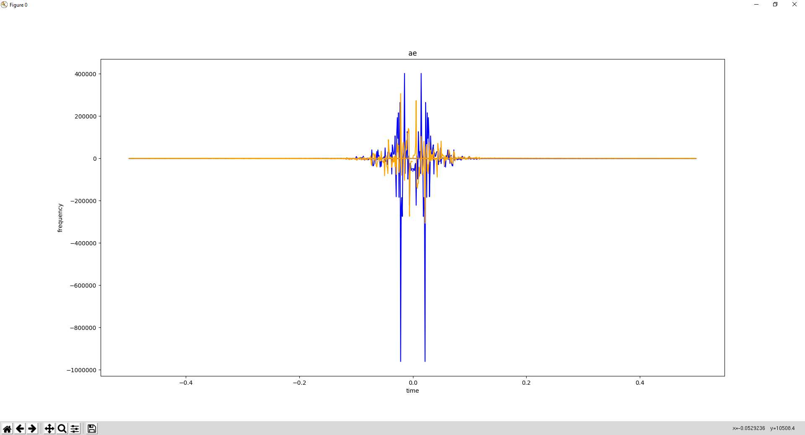

# Fast Fourier Transform module for Bard's Way #
>
> Calculate the fast fourier transform of the given audio segment.
>

## Summary: ##
- Usage
- Functions
- Numpy
- Library Used
- Graphical Result

## Usage: ##
Function `fast_fourier_transform` method to calculate the fast fourier tranform of the given audio.

```python
fast_fourier_transform(frequency = numpy.ndarray)
```
##  Functions: ##

```python
fast_fourier_transform(frequency = numpy.ndarray)
```
>
> Return the fast fourier transform of the give audio segment given as numpy ndarray.
>

#### Parameters: ####
&nbsp;&nbsp;&nbsp;&nbsp;&nbsp;&nbsp;&nbsp;&nbsp;**frequency** The data that we want to analyse.

### Return: ####
&nbsp;&nbsp;&nbsp;&nbsp;&nbsp;&nbsp;&nbsp;&nbsp;Array[0.0, ...].

##  Numpy: ##

`Numpy.ndarray` : An array object represents a multidimensional, homogeneous array of fixed-size items. An associated data-type object describes the format of each element in the array.

`Numpy.fft` returns : Numpy.ndarray of the truncated or zero-padded input, transformed along the axis indicated by axis, or the last one if axis is not specified.

##  Library Used: ##

We use `numpy` and more particulary the `fft` part of Numpy because it's the easiest and efficient way to calculate the the fast fourier transform. And there is many way to reuse this library for many other purpose link with our project.
`Numpy` got the BSD 3-clauses license. The BSD 3-clauses license is permitting us to commercialise our project with the library it protect, so it's perfect for an EIP project.

##  Graphical Result: ##

This graph was generated with this line of code :
```python
do_overlap_plot(numpy.fft.fftfreq(signal.shape[-1]), ae.real, numpy.fft.fftfreq(signal.shape[-1]), ae.imag, labels=["time", "frequency", "ae"])
```



The blue curve represent the frequency of the discret wave present in the audio file.
The orange curve represent the inverse of the blue curve.
