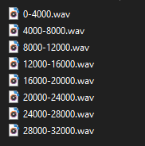

# Four Seconf Spliter module for Bard's Way #
>
> Split a wav into 4 seconds wav.
>

## Summary: ##
- Usage
- Functions

## Usage: ##
Function `four_second_split` to split a given audio in x 4 seconds wav files.

```python
four_second_split(wavFile, dest)
```
##  Functions: ##

```python
four_second_split(wavFile, dest)
```
>
> Create x files of 4 second from a wav file.
>

#### Parameters: ####
&nbsp;&nbsp;&nbsp;&nbsp;&nbsp;&nbsp;&nbsp;&nbsp;**wavFile** The wav file we want to split.

&nbsp;&nbsp;&nbsp;&nbsp;&nbsp;&nbsp;&nbsp;&nbsp;**dest** The destination folder for the splited wav files.

## Result: ##

The four second spliter will create file like this :  
in this case we executed the fonction with a 32 second wav file



the name of the splited wav file correspond to millisecond
