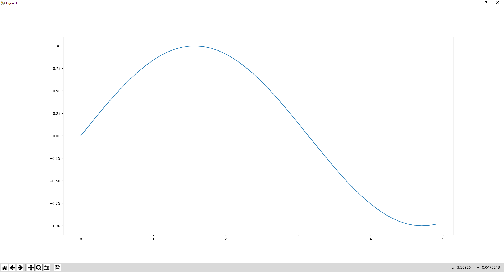
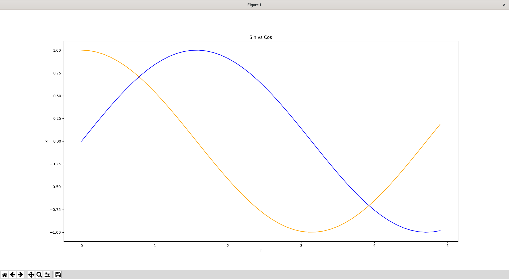

# Graphic display of the different module for Bard's Way #
>
> Show a grapical display for the result of the different module.
>

## Summary: ##
- Usage 1
- Graphic result 1
- Usage 2
- Graphic result 2
- Usage 3
- Graphic result 3
- Library Used

## Usage 1: ##

Function `do_plot` method to generate a graphic depending on the parameters.

```Python
do_plot(x = ndarray , y = ndarray, colors = string, showMarker = False labels=["", "", ""], figure=0)
```

#### Parameters: ####
&nbsp;&nbsp;&nbsp;&nbsp;&nbsp;&nbsp;&nbsp;&nbsp;**x** The x position of the different point of the graph.

&nbsp;&nbsp;&nbsp;&nbsp;&nbsp;&nbsp;&nbsp;&nbsp;**y** The y position of the different point of the graph.

&nbsp;&nbsp;&nbsp;&nbsp;&nbsp;&nbsp;&nbsp;&nbsp;**colors** The colors of the graph, is blue by default.

&nbsp;&nbsp;&nbsp;&nbsp;&nbsp;&nbsp;&nbsp;&nbsp;**showMarker** boolean to show or not the different point composing the graph.

&nbsp;&nbsp;&nbsp;&nbsp;&nbsp;&nbsp;&nbsp;&nbsp;**labels** 3 strings : the first correspond to the absissa,
&nbsp;&nbsp;&nbsp;&nbsp;&nbsp;&nbsp;&nbsp;&nbsp;&nbsp;&nbsp;&nbsp;&nbsp;&nbsp;&nbsp;&nbsp;&nbsp;&nbsp;&nbsp;&nbsp;&nbsp;&nbsp;the second correspond to the ordinate,
&nbsp;&nbsp;&nbsp;&nbsp;&nbsp;&nbsp;&nbsp;&nbsp;&nbsp;&nbsp;&nbsp;&nbsp;&nbsp;&nbsp;&nbsp;&nbsp;&nbsp;&nbsp;&nbsp;&nbsp;&nbsp;the last correspond to the name of the graph.

&nbsp;&nbsp;&nbsp;&nbsp;&nbsp;&nbsp;&nbsp;&nbsp;**figure** Define the number of the figure.

## Graphic result 1: ##

with these parameters :
&nbsp;&nbsp;&nbsp;&nbsp;x = [0 5 0.1]
&nbsp;&nbsp;&nbsp;&nbsp;y = sin(x)



## Usage 2: ##

Function `do_overlap_plot` method to generate two graphic one on top of the other depending on the parameters.

```Python
do_overlap_plot(x1 = ndarray , y1 = ndarray, x2 = ndarray , y2 = ndarray, colors = ["", ""], showMarker = False labels=["", "", ""], figure=0)
```

#### Parameters: ####
&nbsp;&nbsp;&nbsp;&nbsp;&nbsp;&nbsp;&nbsp;&nbsp;**x1** The x position of the different point of the first graph.

&nbsp;&nbsp;&nbsp;&nbsp;&nbsp;&nbsp;&nbsp;&nbsp;**y1** The y position of the different point of the first graph.

&nbsp;&nbsp;&nbsp;&nbsp;&nbsp;&nbsp;&nbsp;&nbsp;**x2** The x position of the different point of the second graph.

&nbsp;&nbsp;&nbsp;&nbsp;&nbsp;&nbsp;&nbsp;&nbsp;**y2** The y position of the different point of the second graph.

&nbsp;&nbsp;&nbsp;&nbsp;&nbsp;&nbsp;&nbsp;&nbsp;**colors** 2 strings : The colors of the two graphs, is blue and orange by default.

&nbsp;&nbsp;&nbsp;&nbsp;&nbsp;&nbsp;&nbsp;&nbsp;**showMarker** boolean to show or not the different point composing the graph.

&nbsp;&nbsp;&nbsp;&nbsp;&nbsp;&nbsp;&nbsp;&nbsp;**labels** 3 strings : the first correspond to the absissa,
&nbsp;&nbsp;&nbsp;&nbsp;&nbsp;&nbsp;&nbsp;&nbsp;&nbsp;&nbsp;&nbsp;&nbsp;&nbsp;&nbsp;&nbsp;&nbsp;&nbsp;&nbsp;&nbsp;&nbsp;&nbsp;the second correspond to the ordinate,
&nbsp;&nbsp;&nbsp;&nbsp;&nbsp;&nbsp;&nbsp;&nbsp;&nbsp;&nbsp;&nbsp;&nbsp;&nbsp;&nbsp;&nbsp;&nbsp;&nbsp;&nbsp;&nbsp;&nbsp;&nbsp;the last correspond to the name of the graph.

&nbsp;&nbsp;&nbsp;&nbsp;&nbsp;&nbsp;&nbsp;&nbsp;**figure** Define the number of the figure.

## Graphic result 2: ##

with these parameters :
&nbsp;&nbsp;&nbsp;&nbsp;x1 = [0 5 0.1]
&nbsp;&nbsp;&nbsp;&nbsp;y1 = sin(x1)
&nbsp;&nbsp;&nbsp;&nbsp;x2 = [0 5 0.1]
&nbsp;&nbsp;&nbsp;&nbsp;y2 = cos(x2)



## Usage 3: ##

Function `do_plot_no_line` method to generate a graphic depending on the parameters. This is the same function as `do_plot` but this one display a graph with point instead of line.

```Python
do_plot_no_line(x = ndarray , y = ndarray, colors = string, showMarker = False labels=["", "", ""], figure=0)
```

#### Parameters: ####

Same as the `do_plot`.

## Graphic result 3: ##


## Library used: ##

To display graphical result like this we used the matplotlib library. One of the best and easy to use graph library.
