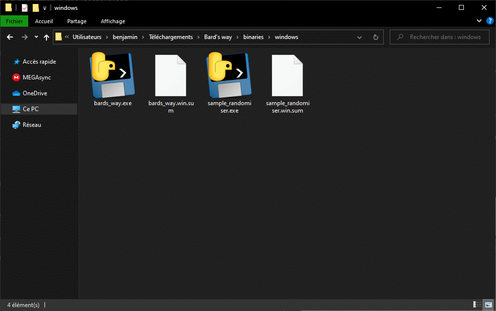
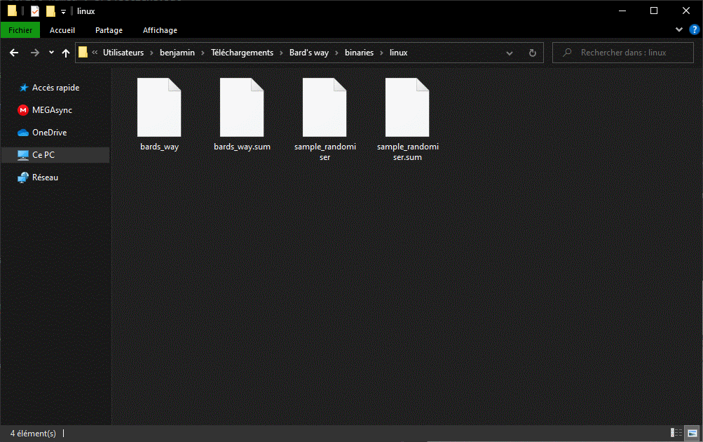

##  Compile Bard's Way project ##
>
> Detail method to compile Bard's Way on different OS
>

##  On Windows: ##

To compile Bard's Way on windows, use the script named : project2exe.bat
Like this :

`.\project2exe.bat [/i]`

It will generate a folder named `binaries` which contain files.exe and their .win.sum

If you don't have python and the dependencies you can run the following: `.\project2exe.bat /i`

Example :

`.\project2exe.bat`

##  On Linux: ##

To compile Bard's Way on Linux, use the script named : project2bin.sh
Like this :

`./project2bin.sh`

It will generate a folder named `binaries` which contain files.exe and their .sum

To install dependency you need Python 3.7.3 and have done the following command : `pip install -r requirement.txt`.

Example :

`./project2bin.sh`

##  On macOS: ##

#### Buy a windows or switch to Linux. ####
