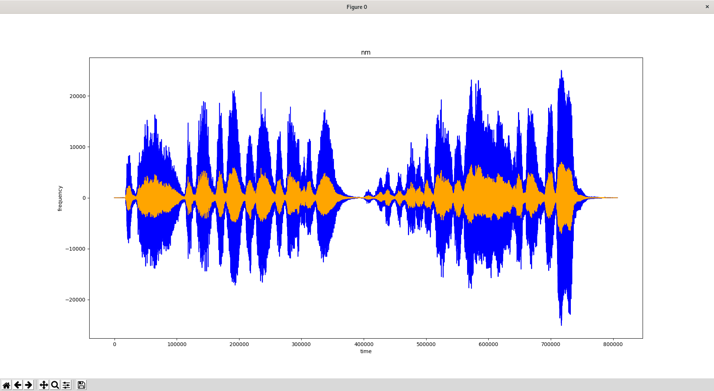

# WAV Merger module for Bard's Way #
>
> Normalise audio tracks in one result WAV file.
>

## Summary: ##
- Usage
- Functions
- Pydub/AudioSegment Data
- Libraries Tested
- Library Used

## Usage: ##
Script `normaliser` method to normalise audio level for all sample to be tested.

```python
normaliser(audio = pydub.AudioSegment, target_dbfs = int())
```
##  Functions: ##

```python
normaliser(audio = pydub.AudioSegment, target_dbfs = int())
```
>
> Normaliser the audio power output into the targeted power value.
>

#### Parameters: ####
&nbsp;&nbsp;&nbsp;&nbsp;&nbsp;&nbsp;&nbsp;&nbsp;**audio** AudioSegment fragment of the file that need to be normalised.
&nbsp;&nbsp;&nbsp;&nbsp;&nbsp;&nbsp;&nbsp;&nbsp;**target_dbfs** Targeted power value used to normalise the sample

##  Pydub/AudioSegment Data: ##

`AudioSegment.dBFS` return : AudioSegment object dBFS value

`AudioSegment.apply_gain(AugioSegment object)` return : AudioSegment object with a new dBFS value

##  Libraries Tested: ##

The only library tested was pydub, the tools and result were more than satisfying for what we wanted
concerning normalisation.

##  Library Used: ##

We use `Pydub` and more particulary the `AudioSegment` part of Pydub because it's the simplest and efficient library to normalise audio files. And there is many way to reuse this library for many other purpose link with our project.
`Pydub` got the MIT license. The MIT license is permitting us to commercialise our project with the library it protect, so it's perfect for an EIP project.

##  Graphical Result: ##

This graph was generated with this line of code :
```python
a = pydub.AudioSegment.from_wav('/tmp/music.wav')
b = normaliser(a, -30.0)
do_overlap_plot(range(len(a.get_array_of_samples())), a.get_array_of_samples(),
                range(len(b.get_array_of_samples())), b.get_array_of_samples(),
                colours=["blue", "orange"], labels=["time", "frequency", "nm"])
```



The blue curve correspond to the normal frequency of the song.
The orange curve correspond to the normalised frequency of the song.
