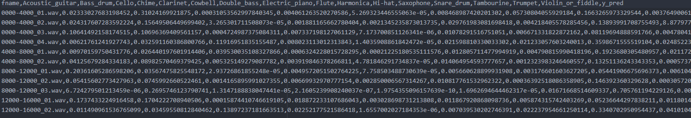
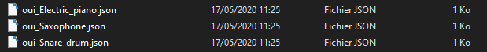
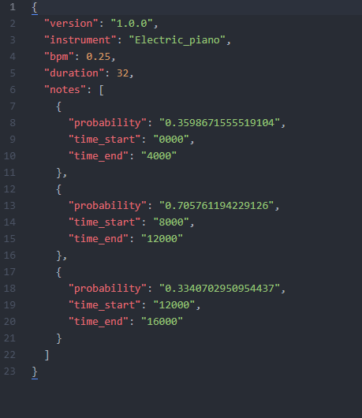

# Output Writer module for Bard's Way #
>
> Write the output of Bardsway into a comprehensive JSON.
>

## Summary: ##
- Usage
- Functions
- Result

## Usage: ##
Call the class `OutputWriter` to generate a clear json file from a csv file.

```python
OutputWriter(filename, output.csv)
```

#### Parameters: ####
&nbsp;&nbsp;&nbsp;&nbsp;&nbsp;&nbsp;&nbsp;&nbsp;**filename** The name of the different JSON OutputWriter will produce

&nbsp;&nbsp;&nbsp;&nbsp;&nbsp;&nbsp;&nbsp;&nbsp;**output.csv** The csv file machine learning produce.

### Return: ####
&nbsp;&nbsp;&nbsp;&nbsp;&nbsp;&nbsp;&nbsp;&nbsp;If the machine learning detect saxophone it will produce a file like so : **filename_Saxophone.json**.

## Result: ##

A csv file look like this (this one is called predictions.csv).



with the command :
```python
OutputWriter("oui", predictions.csv)
```
OutputWriter will produce these files :



The json will be generate like this :



Json description :  
**version** = The version of bardsway  
**instrument** = The instrument the file is about  
**bpm** = The beat per minute of the song  
**duration** = The duration of the sample in second

**notes** = An array composed of the different note of the instrument found in the sample.  
**probability** = probability of the note will be a note of the instrument.  
**time_start** = time where the note begin.  
**time_end** = time where the note end.
