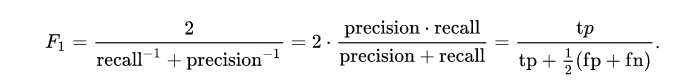

# Note recognition post processing #
>
> Documentation to explain how the postprocessing work in the note recognition part of Bard's Way
>

## Summary: ##
- Description
- Threshold
- Conversion in midi
- Library used

## Description: ##

The post processing is the last part of the program bard's way, it's here to transform the result of the note recognition neural network into readable note and midi file.
It take the result and make it pass trough two algorithm, the threshold and the conversion in midi.

## Threshold: ##

In the current state, the network result is a probability matrix, it consist of 88 value, each position of value correspond to a note in the piano, and the value correspond to the probability that the note is played.  
The goal of the threshold is to transform the probability to a Boolean :  
0 if the note is not played.  
1 if the note is played.  

The Threshold is applied with a f-measure, a f-measure (also called F1 score or f-score) is a mathematical formula use to find which value is the perfect threshold.

The formula is this one :

The value to set is recall and precision in our case we settled them like so :  
recall :  
precision :  

## Conversion in midi: ##

In this state we have a matrix with 88 Boolean generated with the threshold.  
The goal now is to convert this matrix in midi. The conversion is simple in fact because the midi is a music file directly written, it is not compress, but it is an audio file completely coded (unlike analog file like wav)  
We decided to convert in midi directly because it's an international type of file, every music software can read them and play them, for our goal to touch music professional, it is the perfect alternative to piano sheet.

## Library Used: ##

For the Threshold we used :  

For the conversion in midi we used :
