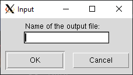
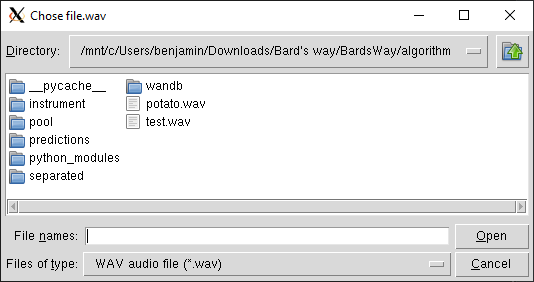

# Sample Randomizer module for Bard's Way #
>
> Merge random samples in wav files to a final WAV file.
>

## Summary: ##
- Usage
- Functions
- Library Used
- GUI

## Usage: ##
## In script: ##
Function `sample_randomizer` method to create an audio file from random samples.

```python
sample_randomizer(in_path = str(), out_path = str())
```
##  Functions: ##

```python
sample_randomizer(in_path = str(), out_path = str())
```
>
> Generate an audio file made of random instruments samples.
>

#### Parameters: ####
&nbsp;&nbsp;&nbsp;&nbsp;&nbsp;&nbsp;&nbsp;&nbsp;**in_path** Path to the samples.
&nbsp;&nbsp;&nbsp;&nbsp;&nbsp;&nbsp;&nbsp;&nbsp;**out_path** Path for the generated file.

### Return: ####
&nbsp;&nbsp;&nbsp;&nbsp;&nbsp;&nbsp;&nbsp;&nbsp;0 if everything is ok, 1 if missing parameters, 2 if they number of samples is too small otherwise see wav_merger documentation.

## As script: ##
```sh
python ./sample_randomizer.py path_to_sample_pool path_for_output [number_of_samples_to_generate]
```

If `number_of_samples_to_generate` is given, it will generate N samples and create a file with all samples concatenated.

##  Library Used: ##

We use `Pydub` and more particulary the `AudioSegment` part of Pydub because it's the simpliest and efficient library to get file duration. And there is many way to reuse this library for many other purpose link with our project.
`Pydub` got the MIT license. The MIT license is permitting us to commercialise our project with the library it protect, so it's perfect for an EIP project.

## GUI: ##

When you launch the sample randomizer a window will ask you what name you want for the output file.



Then another window will ask you yo choose the sample.


