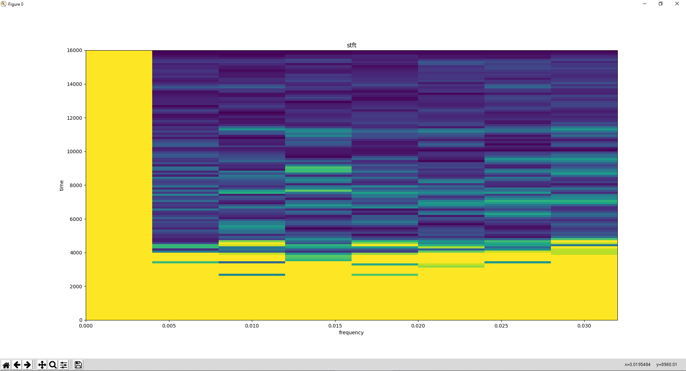

# Short Fourier Transform module for Bard's Way #
>
> Find the short fourier transform of the audio sample.
>

## Summary: ##
- Usage
- Functions
- Numpy & Pywt
- Library Used
- Graphical Result

## Usage: ##
Class `ShortTimeFourierTransform` with method to calculate the short fourier transform of the given audio sample.

```python
__init__(self)
analyse_once(self, x = Numpy.ndarray, fs = Float(), nperseg = Int(), no_overlap = Int())
__save_data(self, x = Numpy.ndarray, fs = Float(), nperseg = Int(), no_overlap = Int())
data(self)
```
##  Functions: ##

```python
__init__(self)
```
>
> Initiate the class.
>

#### Parameters: ####
&nbsp;&nbsp;&nbsp;&nbsp;&nbsp;&nbsp;&nbsp;&nbsp;**self** self.

---

```python
analyse_once(self, x = Numpy.ndarray, fs = Float(), nperseg = Int(), no_overlap = Int())
```
>
> Get the short fourier transform and save it in __data then return it.
>

#### Parameters: ####
&nbsp;&nbsp;&nbsp;&nbsp;&nbsp;&nbsp;&nbsp;&nbsp;**self** self.
&nbsp;&nbsp;&nbsp;&nbsp;&nbsp;&nbsp;&nbsp;&nbsp;**x** Time series of measurment values.
&nbsp;&nbsp;&nbsp;&nbsp;&nbsp;&nbsp;&nbsp;&nbsp;**fs** Sampling frequency of the x time series.
&nbsp;&nbsp;&nbsp;&nbsp;&nbsp;&nbsp;&nbsp;&nbsp;**nperseg** Length of te segment.
&nbsp;&nbsp;&nbsp;&nbsp;&nbsp;&nbsp;&nbsp;&nbsp;**no_overlap** Number of points to overlap.

### Return: ###
&nbsp;&nbsp;&nbsp;&nbsp;&nbsp;&nbsp;&nbsp;&nbsp;{"frequencie": Numpy.ndarray, "time": Numpy.ndarray, "Zxx": Numpy.ndarray}.

---

```python
__save_data(self, x = Numpy.ndarray, fs = Int(), nperseg = Int(), no_overlap = Bool())
```
>
> Get the short fourier transform and save it in __data.
>

#### Parameters: ####
&nbsp;&nbsp;&nbsp;&nbsp;&nbsp;&nbsp;&nbsp;&nbsp;**self** self.
&nbsp;&nbsp;&nbsp;&nbsp;&nbsp;&nbsp;&nbsp;&nbsp;**x** Time series of measurment values.
&nbsp;&nbsp;&nbsp;&nbsp;&nbsp;&nbsp;&nbsp;&nbsp;**fs** Sampling frequency of the x time series.
&nbsp;&nbsp;&nbsp;&nbsp;&nbsp;&nbsp;&nbsp;&nbsp;**nperseg** Length of te segment.
&nbsp;&nbsp;&nbsp;&nbsp;&nbsp;&nbsp;&nbsp;&nbsp;**no_overlap** Number of points to overlap.

### Return: ###
&nbsp;&nbsp;&nbsp;&nbsp;&nbsp;&nbsp;&nbsp;&nbsp;{"frequencie": Numpy.ndarray, "time": Numpy.ndarray, "Zxx": Numpy.ndarray}.

---

```python
data(self)
```
>
> Get the __data of the class.
>

#### Parameters: ####
&nbsp;&nbsp;&nbsp;&nbsp;&nbsp;&nbsp;&nbsp;&nbsp;**self** self.

### Return: ###
&nbsp;&nbsp;&nbsp;&nbsp;&nbsp;&nbsp;&nbsp;&nbsp;{"frequencie": Numpy.ndarray, "time": Numpy.ndarray, "Zxx": Numpy.ndarray}.

##  Scipy.signal ##

`signal.stft` : Compute the Short Time Fourier Transform to quantify the change of a nonstationary signal's frequency and phase content over time.

##  Library Used: ##

We use `scipy` and more particulary the `signal` part because it's the best mathematical answer to calculate the the short time fourier transform with multiple variation.
`scipy` got the BSD-new license. The BSD-new license is permitting us to commercialise our project with the library it protect, so it's perfect for an EIP project.

##  Graphical Result: ##

This graph was generated with this line of code :
```python
do_mesh(stft["time"], stft["frequency"], stft["Zxx"], labels=["time", "frequency", "stft"])
```



It is a generation of a well known windows media player visual template.
