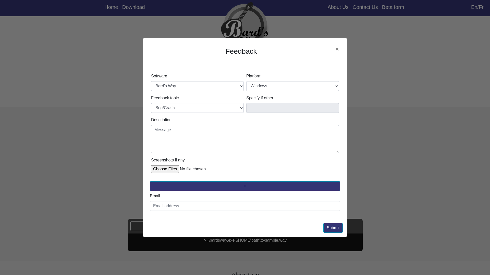
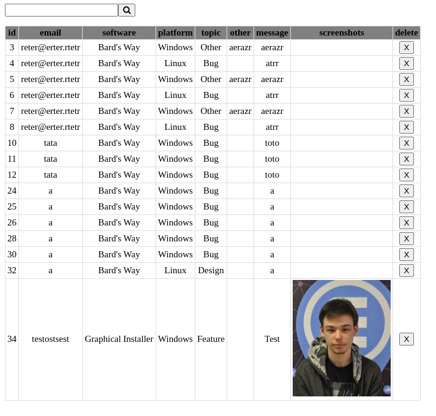
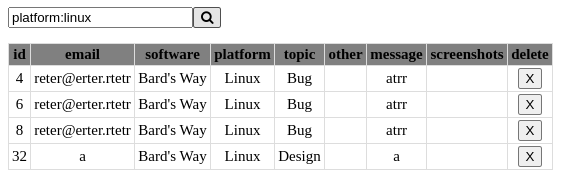
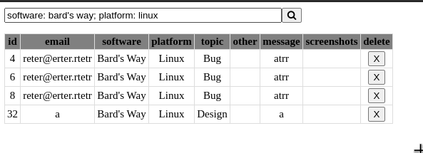

# Bard's Way showcase website #
>
> Documentation for the showcase website of Bard's Way
>

## Summary: ##
- General Front

- Bug report form
- Report viewer

## General Front: ##

The website is separated in four part :  

- The description of the project
- The download
- How to install the Bard's Way
- About us

The site is looking like this :

On this page you can see  the description, the download part and the how to install Bard's Way

This is the rest of the page where you can see the About Us part

##  Bug report form: ##

We made a bug report form that you can access by clicking on the "Beta Form" text (to be changed)

On this form the user can input different choice for us to store it much easily.
The user can precise wich software he want to talk about, wich platform he's in (windows or linux), he can precise the topic and he can write a description of the problem with a picture if he want to.  
With the "+" he can add another bug report (he can add an infinite number of report if he need to)  
Then the user is invited to write his email address.

##  Report viewer: ##

On the back end we developed a short webpage to see all the bug report and sort them all like we want.  

The page is composed of a table containing all the report we received and a search bar at the top.

You can sort the table by writing the keyword you want to keep.
It's written like so :  
If you want to keep all the report concerning linux you juste write "platform:linux" on the search bar and click the magnifying glass.
You can also search by software or topic with the same syntax.

You can also make multiple sorting at the same time like this :
"platform:linux; software:bard's way"

