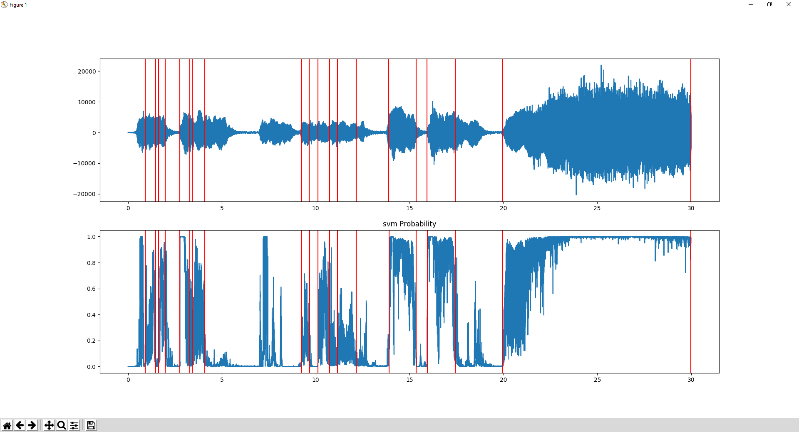

# Silence and Attack Segment module for Bard's Way #
>
> Calculate the Silence and Attack Segment of the given audio segment.
>

## Summary: ##
- Usage
- Functions
- Library Used

## Usage: ##
Function `dwt` method to calculate the simple discret wavelet of the given audio.

```python
dwt(frequency = numpy.ndarray)
```
##  Functions: ##

```python
dwt(frequency = numpy.ndarray)
```
>
> Return an approximation and detail coefficients of the audio segment discret wavelet.
>

#### Parameters: ####
&nbsp;&nbsp;&nbsp;&nbsp;&nbsp;&nbsp;&nbsp;&nbsp;**** des

### Return: ###
&nbsp;&nbsp;&nbsp;&nbsp;&nbsp;&nbsp;&nbsp;&nbsp;explain return

##  Library Used: ##

##  Graphical Result: ##

This graph was generated with this line of code :
```python
silenceRemoval -i ../../toccata30s.wav --smoothing 0.001 --weight 0.01
```



The blue curve correspond to the frequency of the song.
Each silent segment is between two red lines. So the first red line correspond to the begining of a silent segment and the second red line correspond to the begining of an attack segment.
