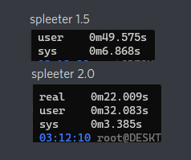

# Spleeter 2.0 #
>
> Spleeter 2.0 documentation and semi-changelog
>

## General update ##

Spleeter 2.0 is the new version of spleeter, it include many useful functionality that we will describe here, we implemented it for the September-December 2020 sprint.  
It change many thing for the project and the implementation of Spleeter 2.0 permit us to deliver far better final product.

- Before, we needed to make work 2 version of tensorflow simultaneously. Spleeter 2.0 work with the last version of tensorflow so we could uninstall one version of tensorflow and the compilation is far easier.  
 We passed from Tensorflow 1.5.0 to Tensorflow 2.3.0 for the whole Bard's Way projet.

- With this modification the total size of Bard's Way change from 968Mo to 647Mo.

- With only one version of Tensorflow running the time needed to the whole process of Bard's Way reduced significantly as we can see on this screenshot.

Now the new models are all trained with Spleeter 2.0, and the usage of Tensorflow make the training way more shorter.
