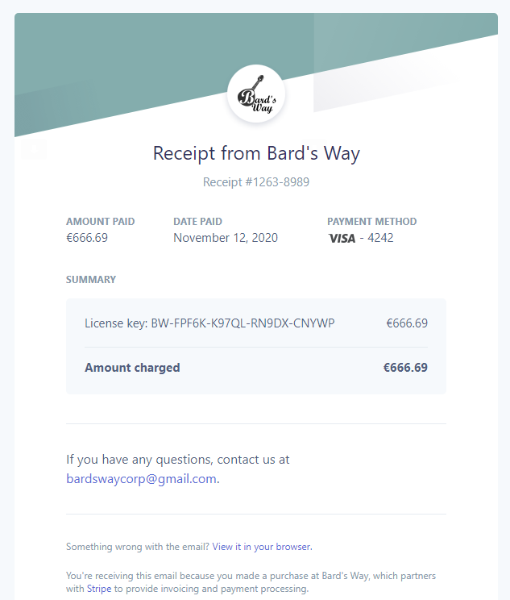

# Stripe Payment #
>
> Bard's Way Stripe Payment documentation
>

## Summary: ##
- Front
  - Payment page
  - Mail receipt
- Back
  - Route

## Front: ##

#### Payment page: ####

This is the payment page in the website, here the customer must enter is personal information to make the payment and then click on the "buy" button.


The customer choose is payment method within multiple option, after that he must enter his card number, expiration date, the name on the card and the CVC.

Then the customer enter his facturation info, the city, the country, his adress, postal code and state if it is a country with state.

When the user click the "Pay" button it launch the sequence describe in the pay route in back end.

#### Mail receipt: ####

Stripe generate and send this model of receipt to the customer after the buying process is done



It precise us the price we paid, the date we paid, the payment method we used.  
And with this, it send us the license key to you us the software.  
It also precise our contact email.

## Back: ##

#### Route: ####

`/product(get)` :
The product route is used to get Bard's Way product information.
**Return** :  A JSON with the information is returned name, price and image.

`/pay(post)` :
The pay route is used to make a payment, it take the info of the customer and return a license key.
**Return** : It return a license key if the payment is a success.
**Argument** : need a payment Method generated with the information the customer has entered in the payment page.
```json
{
  "paymentMethod":"ezaf181azd19",
}
```
**Error** : Two error can happen if there is a missing payment method, or if there is an error during the payment.

The pay route is a little more complex, here it what it do in detail.

After it get the payment method, it retrieve the price information,  
It get the customer thanks to the stripe ID.  
It create the payment intend, with the following argument : Price, Currency, Customer ID, payment method ID, receipt email.  
It assigned a license key previously generated to a customer id.  
At the end the payment intend is confirmed and is sent.  

The payment method is automatically generated by Stripe using the information the user provided in the payment page, Stripe generated the payment method with information inputed like this :
```json
{
    "number": "4242424242424242",
    "exp_month": 4,
    "exp_year": 2021,
    "cvc": "234",
    "name": "Bard's Way",
    "address": {
        "city": "Villejuif",
        "country": "FR",
        "line1": "67-81 Avenue de Stalingrad",
        "line2": null,
        "postal_code": "94800",
        "state": null
    }
}
```
